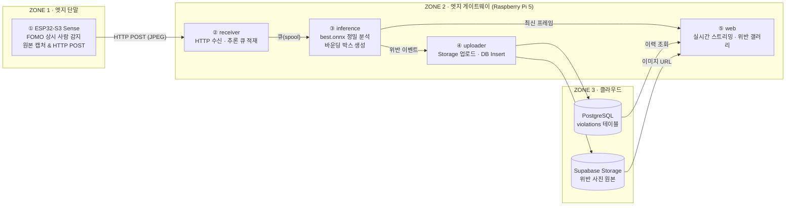
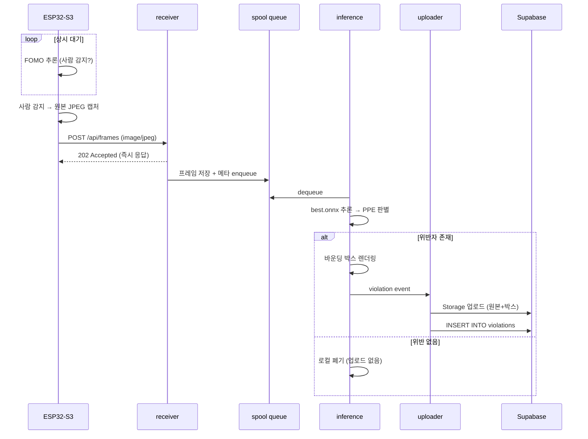

# 프로젝트 개요

ESP32 엣지 단말(FOMO 기반 1차 사람 감지) → Raspberry Pi 5 게이트웨이(Docker, ONNX Runtime 기반 2차 위반 분석) → 클라우드(Storage + DB) 로 이어지는 실시간 위반 감지 시스템.

## 구성

- [`esp32/`](esp32/) — ESP32 펌웨어 (ESP-IDF 기반, 카메라 캡처 및 HTTP POST 전송)
- [`raspberry-pi/`](raspberry-pi/) — Pi 5 게이트웨이 (Docker 컨테이너 2개: receiver, inference)
- [`web/`](web/) — 웹 대시보드 (별도 구성 예정)

## 담당

- ESP32: TBD
- Raspberry Pi: TBD
- Web: TBD

# Edge AI와 클라우드로 만드는 스마트 산업 안전 시스템

> ESP32-S3와 Raspberry Pi 5를 연결해 보호장구(PPE) 미착용자를 탐지하는 엔드투엔드 IoT 파이프라인

| 항목 | 내용 |
|---|---|
| 문서 종류 | PRD (Product Requirements Document) |
| 버전 | v0.1 (Draft) |
| 최종 수정 | 2026-08-28 |
| 상태 | 검토 대기 |
| 대상 독자 | 개발팀, 리뷰어 |

---

## 1. 개요 (Overview)

산업 현장에서 안전모·안전조끼 미착용은 중대재해로 직결되는 핵심 위험 요인이다. 본 프로젝트는 **초소형 엣지 카메라(ESP32-S3)** 가 사람을 1차 감지하고, **엣지 게이트웨이(Raspberry Pi 5)** 가 PPE 착용 여부를 정밀 판별한 뒤, **위반 사건이 발생한 순간에만** 클라우드(Supabase)에 증거 사진과 메타데이터를 적재하는 3계층 파이프라인을 구축한다.

**Mission Goal**
> 사람을 감지하고, 안전모/조끼 착용 여부를 분석해 클라우드에 자동 기록하는 엔드투엔드 IoT 파이프라인 완성하기

---

## 2. 배경 및 문제 정의 (Problem Statement)

### 2.1 기존 CCTV 방식의 한계

| 문제 | 상세 |
|---|---|
| **24시간 모니터링 부담** | 사람이 직접 화면을 감시해야 하며, 관제 인력의 피로도가 누적되어 실제 위반 순간을 놓친다. |
| **막대한 인프라 비용** | 모든 영상을 상시 전송·저장하는 구조는 서버 비용과 통신비를 감당할 수 없다. |

### 2.2 우리의 스마트 엣지 접근

| 해법 | 상세 |
|---|---|
| **자동화된 1차 판단** | 엣지 단말이 상시 추론하며 "사람이 있는 프레임"만 골라낸다. 무의미한 트래픽을 원천 차단. |
| **계층형 시스템 구축** | 이벤트가 발생한 순간에만 클라우드로 적재한다. 저장·전송 비용을 이벤트 발생량에 비례하도록 최적화. |

**핵심 설계 원칙: 데이터는 아래로 갈수록 줄어든다.**
`상시 프레임 → (FOMO 사람 감지) → 사람이 있는 프레임 → (YOLOv8 PPE 분석) → 위반 프레임만 클라우드`

---

## 3. 목표 및 비목표 (Goals / Non-Goals)

### 3.1 Goals

| # | 목표 | 검증 방법 |
|---|---|---|
| G1 | 기기 간 HTTP 통신 연동 파이프라인 구축 | ESP32 → Pi5 이미지 POST 성공률 측정 |
| G2 | AI 모델 경량화 및 변환 (ONNX 포맷 적용) | `best.pt` → `best.onnx` 변환 후 mAP 동등성 확인 |
| G3 | 4종의 Docker 컨테이너 마이크로서비스 구성 | `docker compose up` 단일 명령으로 전체 기동 |
| G4 | 클라우드 DB 및 Storage(Supabase) 실시간 연결 | 위반 발생 시 `violations` 테이블 + Storage 객체 동시 생성 |
| G5 | 현장 실시간 스트리밍 및 위반 이력 웹 대시보드 제공 | 브라우저에서 스트리밍 + 갤러리 조회 |

### 3.2 Non-Goals (이번 범위에서 제외)

- 실시간 비디오 스트림(RTSP) 기반 연속 추론 — 본 시스템은 **이벤트 트리거 방식의 정지 이미지 파이프라인**이다.
- YOLOv8 모델 재학습 및 데이터셋 구축 (사전 학습된 `best.pt` 사용).
- 다중 카메라 클러스터링, 사용자 인증/권한 관리, 알림(SMS/Push) 발송.
- 개인 식별(얼굴 인식) 및 신원 추적.

---

## 4. 성공 지표 (Success Metrics)

| 지표 | 목표값 | 측정 위치 |
|---|---|---|
| End-to-End 지연 (촬영 → DB 적재) | ≤ 3초 (p95) | Pi5 로그 타임스탬프 |
| Pi5 단일 추론 시간 (ONNX, CPU) | ≤ 700ms / frame | inference 컨테이너 |
| 이미지 전송 성공률 | ≥ 99% | receiver 컨테이너 카운터 |
| 클라우드 업로드 성공률 | ≥ 99.9% (재시도 포함) | uploader 컨테이너 |
| 불필요 업로드 비율 | 위반 없는 프레임 업로드 0건 | Supabase Storage 감사 |

---

## 5. 시스템 아키텍처

### 5.1 3-Zone 구조

| Zone | 하드웨어 | 역할 | 기술 스택 |
|---|---|---|---|
| **Zone 1 — 엣지 단말** | Seeed XIAO ESP32-S3 Sense | 상시 관찰, 사람 감지 시 원본 캡처 및 HTTP POST | ESP32-S3, Edge Impulse (FOMO) |
| **Zone 2 — 엣지 게이트웨이** | Raspberry Pi 5 | 이미지 수신, PPE 정밀 분석, 클라우드 적재, 웹 서비스 | Docker, ONNX Runtime, YOLOv8 |
| **Zone 3 — 클라우드 관제** | Supabase | 위반 사진 원본 저장 + 메타데이터 DB 적재 | Supabase Storage, PostgreSQL |

### 5.2 전체 흐름도



### 5.3 시퀀스 다이어그램



> **⚠️ 확인 필요 (Open Issue #1)**
> 슬라이드 4에는 "4종의 Docker 컨테이너"라고 명시되어 있으나, 슬라이드 5의 흐름도에는 Zone 2 내부에 ②·③·⑤ 세 개의 블록만 그려져 있고 ④(클라우드 적재)는 Zone 3 영역에 배치되어 있다. 본 문서는 **④를 Pi5에서 동작하는 `uploader` 컨테이너로 해석**하여 `receiver / inference / uploader / web` 4종으로 정의했다. 만약 팀의 의도가 "④를 inference에 통합하고 Redis 등 큐 브로커를 4번째 컨테이너로 두는 것"이라면 §6을 수정해야 한다.

---

## 6. 컨테이너 명세 (Zone 2)

| # | 컨테이너 | 책임 | 입력 | 출력 | 노출 포트 |
|---|---|---|---|---|---|
| ② | `receiver` | ESP32의 HTTP 요청 수신, 유효성 검사, 추론 큐 적재. **추론을 기다리지 않고 즉시 202 응답**하여 ESP32의 소켓 점유를 최소화. | HTTP POST (JPEG) | spool 파일 + 메타 JSON | 8080 (LAN) |
| ③ | `inference` | `best.onnx` 로드, PPE 판별, 위반 시 바운딩 박스 렌더링 후 이벤트 발행. | spool 큐 | violation event, 최신 프레임 | - |
| ④ | `uploader` | Supabase Storage 업로드 + `violations` INSERT. **네트워크 실패 시 재시도 및 로컬 보관.** | violation event | Supabase 객체/레코드 | - |
| ⑤ | `web` | 현장 실시간 스트리밍(최신 프레임) 제공 및 클라우드 위반 이력/갤러리 전시. | 최신 프레임, Supabase | HTML/MJPEG/JSON | 3000 |

### 6.1 컨테이너 간 통신 방식

**채택안: 공유 볼륨 기반 spool 큐**

- `/spool/incoming/` — receiver가 `{timestamp}_{device_id}.jpg` + `.json` 페어로 기록
- `/spool/violations/` — inference가 위반 이벤트를 기록, uploader가 소비 후 `/spool/uploaded/`로 이동
- `/spool/latest.jpg` — inference가 원자적 rename으로 갱신, web이 스트리밍에 사용

**선정 사유**
1. 추가 브로커 프로세스 없이 커널의 파일시스템 원자성(`rename(2)`)만으로 큐 시맨틱을 확보한다. 컨테이너 4종 제약을 만족하면서도 장애 지점이 늘지 않는다.
2. `uploader`가 다운되어도 위반 이벤트가 디스크에 남아 **재기동 시 자동 복구**된다 (클라우드 적재 유실 방지).
3. `/spool/incoming/`은 tmpfs로 마운트해 SD카드 쓰기 수명을 보호하고, `/spool/violations/`만 디스크에 두어 내구성을 확보한다.

> 대안: Redis(list) 브로커. 처리량은 우수하나 컨테이너가 1종 추가되고, Redis 프로세스 사망 시 미처리 위반 이벤트가 증발한다. 본 시스템의 트래픽(이벤트당 1프레임)에서는 이점이 없다.

---

## 7. 인터페이스 명세

### 7.1 ESP32 → receiver

```
POST /api/frames HTTP/1.1
Host: <PI5_IP>:8080
Content-Type: image/jpeg
Content-Length: <bytes>
X-Device-Id: esp32-cam-01
X-Captured-At: 1756339200        # Unix epoch (sec)
X-Person-Count: 2                # FOMO 감지 객체 수
X-Fomo-Confidence: 0.87
```

**응답**

| 코드 | 의미 | ESP32 동작 |
|---|---|---|
| `202 Accepted` | 큐 적재 성공 | 다음 감지 대기로 복귀 |
| `400 Bad Request` | 헤더 누락 / 비 JPEG | 로그 후 폐기 |
| `413 Payload Too Large` | 크기 초과 (> 512KB) | 해상도 낮춰 재시도 |
| `503 Service Unavailable` | 큐 포화 | 지수 백오프 후 재시도 (최대 3회) |

### 7.2 spool 메타 JSON 스키마

```json
{
  "frame_id": "20260828T120000Z_esp32-cam-01",
  "device_id": "esp32-cam-01",
  "captured_at": "2026-08-28T12:00:00Z",
  "received_at": "2026-08-28T12:00:00.412Z",
  "person_count_edge": 2,
  "fomo_confidence": 0.87,
  "image_path": "/spool/incoming/20260828T120000Z_esp32-cam-01.jpg"
}
```

### 7.3 violation event 스키마 (inference → uploader)

```json
{
  "frame_id": "20260828T120000Z_esp32-cam-01",
  "device_id": "esp32-cam-01",
  "captured_at": "2026-08-28T12:00:00Z",
  "violation_types": ["no_helmet", "no_vest"],
  "person_count": 2,
  "violator_count": 1,
  "max_confidence": 0.91,
  "inference_ms": 612,
  "detections": [
    { "class": "person",    "conf": 0.94, "bbox": [120, 80, 260, 460] },
    { "class": "no_helmet", "conf": 0.91, "bbox": [150, 82, 230, 140] }
  ],
  "raw_image_path": "/spool/violations/xxx_raw.jpg",
  "annotated_image_path": "/spool/violations/xxx_box.jpg"
}
```

### 7.4 web API

| 메서드 | 경로 | 설명 |
|---|---|---|
| `GET` | `/` | 대시보드 (실시간 뷰 + 최근 위반) |
| `GET` | `/stream` | MJPEG 스트림 (최신 프레임 반복 송출) |
| `GET` | `/api/violations?limit=50&offset=0` | Supabase 위반 이력 조회 |
| `GET` | `/api/health` | 컨테이너 4종 헬스 상태 |

---

## 8. 데이터 모델 (Zone 3 · Supabase)

### 8.1 `violations` 테이블

```sql
create table public.violations (
  id                uuid primary key default gen_random_uuid(),
  frame_id          text        not null unique,   -- 멱등성 키 (재시도 중복 방지)
  device_id         text        not null,
  captured_at       timestamptz not null,          -- ESP32 촬영 시각
  created_at        timestamptz not null default now(),

  violation_types   text[]      not null,          -- {'no_helmet','no_vest'}
  person_count      int         not null default 0,
  violator_count    int         not null default 0,
  max_confidence    real,

  raw_image_path        text    not null,          -- Storage 객체 경로
  annotated_image_path  text,

  detections        jsonb       not null,          -- 원본 바운딩 박스 배열
  inference_ms      int
);

create index idx_violations_captured_at on public.violations (captured_at desc);
create index idx_violations_device      on public.violations (device_id, captured_at desc);
create index idx_violations_types       on public.violations using gin (violation_types);
```

> `frame_id`에 `unique` 제약을 두고 `on conflict (frame_id) do nothing`으로 INSERT한다. uploader가 네트워크 타임아웃 후 재시도해도 중복 레코드가 생기지 않는다.

### 8.2 Storage 버킷

| 버킷 | 경로 규칙 | 공개 여부 |
|---|---|---|
| `violation-images` | `{device_id}/{YYYY-MM-DD}/{frame_id}_raw.jpg` | Private (Signed URL 발급) |
| `violation-images` | `{device_id}/{YYYY-MM-DD}/{frame_id}_box.jpg` | Private (Signed URL 발급) |

> 현장 인물이 촬영되므로 버킷을 public으로 열지 않는다. web은 서버 사이드에서 Signed URL(TTL 1시간)을 발급해 갤러리에 노출한다.

---

## 9. AI 모델 명세

### 9.1 Zone 1 — FOMO (Edge Impulse)

| 항목 | 값 |
|---|---|
| 목적 | 사람 존재 여부 1차 필터링 (트리거) |
| 모델 | FOMO (Faster Objects, More Objects) |
| 입력 | 96×96 또는 160×160 grayscale/RGB |
| 베이스 코드 | `esp32_camera.ino` (제공됨) |
| 트리거 조건 | `person_count ≥ 1 && confidence ≥ 0.6` |
| 캡처 해상도 | JPEG, 최소 VGA(640×480) 이상 — **추론용 저해상도가 아닌 원본을 전송** |
| 쿨다운 | 동일 장면 폭주 방지를 위해 전송 후 3초 대기 |

### 9.2 Zone 2 — YOLOv8 → ONNX

| 항목 | 값 |
|---|---|
| 원본 | `safety/best.pt` (사전 학습된 PPE 탐지 모델) |
| 변환 포맷 | ONNX (opset 12) |
| 런타임 | ONNX Runtime (CPU, Raspberry Pi 5 / ARM64) |
| 입력 크기 | 640×640 (지연 목표 미달 시 320×320으로 하향 검토) |

**변환 커맨드**

```bash
yolo export model=safety/best.pt format=onnx imgsz=640 opset=12 simplify=True
```

**구현 주의사항**
- Ultralytics의 기본 ONNX export는 **NMS가 포함되지 않는다.** 출력 텐서 `(1, 4+nc, 8400)`에 대해 파이썬 측에서 confidence threshold → NMS → 좌표 역변환(letterbox 보정)을 직접 구현해야 한다.
- ONNX Runtime 세션은 컨테이너 기동 시 1회만 생성하고 재사용한다. 프레임마다 재생성하면 지연이 수 배로 증가한다.
- `sess_options.intra_op_num_threads`를 Pi5 코어 수(4)에 맞춰 명시적으로 설정한다.

> **⚠️ 확인 필요 (Open Issue #2)**
> `best.pt`의 클래스 맵이 문서화되어 있지 않다. 아래 두 가지 설계가 가능하며, 위반 판정 로직이 완전히 달라진다.
>
> - **(A) 부정 클래스 포함형**: `['helmet','no_helmet','vest','no_vest','person']` → `no_helmet`/`no_vest` 검출 자체가 위반.
> - **(B) 착용 클래스만 존재**: `['helmet','vest','person']` → `person` 박스와 `helmet`/`vest` 박스를 IoU 매칭하여 **미매칭 인원을 위반으로 역산**해야 한다.
>
> 첫 태스크로 `python -c "from ultralytics import YOLO; print(YOLO('safety/best.pt').names)"`를 실행해 확정한 뒤 §9.3을 확정한다.

### 9.3 위반 판정 로직 (설계 B 기준 초안)

```
1. person 박스 집합 P, helmet 박스 집합 H, vest 박스 집합 V를 추출
2. 각 p ∈ P 에 대해:
   - p의 상단 25% 영역과 IoU > 0.1 인 h ∈ H 가 없으면 → no_helmet
   - p의 몸통 영역(상단 20%~70%)과 IoU > 0.2 인 v ∈ V 가 없으면 → no_vest
3. 위반이 1건 이상이면 violation event 발행
4. 위반 0건이면 프레임 폐기 (클라우드 업로드 없음)
```

**오탐 억제**: 프레임 경계에 걸쳐 잘린 person 박스(면적 < 전체의 2% 또는 이미지 가장자리 접촉)는 판정에서 제외한다.

---

## 10. 비기능 요구사항

| 분류 | 요구사항 |
|---|---|
| **성능** | 추론 컨테이너는 프레임당 700ms 이내 처리. 큐 적체 시 최신 프레임 우선(LIFO) 처리로 실시간성 확보. |
| **비용** | 위반이 없는 프레임은 클라우드로 전송하지 않는다. 이는 시스템의 핵심 가치 명제이므로 절대 위반 금지. |
| **신뢰성** | 인터넷 단절 시에도 Zone 1·2는 정상 동작해야 한다. 위반 이벤트는 로컬 spool에 보관되고 복구 후 자동 업로드된다. |
| **내구성** | `/spool/incoming`은 tmpfs(휘발성), `/spool/violations`는 디스크(영속). 사람 감지 프레임 유실은 허용, 위반 증거 유실은 불허. |
| **보안** | Supabase `service_role` 키는 uploader 컨테이너에만 주입한다. web은 anon 키 또는 서버 사이드 프록시만 사용. 키는 `.env`로 관리하고 저장소에 커밋하지 않는다. |
| **프라이버시** | 현장 인물이 촬영되므로 Storage는 Private + Signed URL. 보존 기간(예: 90일) 경과 객체는 삭제 정책 적용을 권장. |
| **운영성** | 모든 컨테이너는 `restart: unless-stopped`. 구조화 로그(JSON) 출력으로 `docker compose logs` 추적 가능. |

---

## 11. 프로젝트 구조

```
smart-safety-system/
├── README.md
├── docker-compose.yml
├── .env.example
├── firmware/
│   └── esp32_camera/
│       └── esp32_camera.ino        # FOMO 감지 + HTTP POST
├── models/
│   ├── best.pt                     # 원본 (제공)
│   ├── best.onnx                   # 변환 산출물
│   └── export_onnx.py
├── services/
│   ├── receiver/
│   │   ├── Dockerfile
│   │   ├── requirements.txt
│   │   └── main.py
│   ├── inference/
│   │   ├── Dockerfile
│   │   ├── onnx_runner.py          # 세션 관리 + 전처리/NMS
│   │   ├── ppe_rules.py            # 위반 판정 로직
│   │   └── main.py
│   ├── uploader/
│   │   ├── Dockerfile
│   │   └── main.py                 # Supabase Storage + DB
│   └── web/
│       ├── Dockerfile
│       ├── templates/
│       └── main.py
├── db/
│   └── schema.sql
└── docs/
    └── architecture.md
```

---

## 12. 실행 방법

### 12.1 사전 준비

```bash
git clone <repo-url> && cd smart-safety-system
cp .env.example .env      # Supabase 자격증명 입력
python models/export_onnx.py   # best.pt → best.onnx
```

### 12.2 환경 변수 (`.env`)

| 키 | 설명 | 사용 컨테이너 |
|---|---|---|
| `SUPABASE_URL` | 프로젝트 URL | uploader, web |
| `SUPABASE_SERVICE_KEY` | service_role 키 (쓰기 권한) | uploader |
| `SUPABASE_ANON_KEY` | anon 키 (읽기 전용) | web |
| `SUPABASE_BUCKET` | `violation-images` | uploader, web |
| `MODEL_PATH` | `/models/best.onnx` | inference |
| `CONF_THRESHOLD` | 기본 `0.5` | inference |
| `IOU_THRESHOLD` | NMS 임계값, 기본 `0.45` | inference |
| `SPOOL_DIR` | `/spool` | receiver, inference, uploader, web |

### 12.3 기동

```bash
docker compose up -d --build
docker compose ps                 # 4개 컨테이너 Running 확인
curl -I http://localhost:8080/api/health
```

### 12.4 ESP32 설정

`firmware/esp32_camera/esp32_camera.ino` 상단의 상수를 현장 값으로 수정 후 업로드한다.

```cpp
const char* WIFI_SSID   = "...";
const char* WIFI_PASS   = "...";
const char* SERVER_URL  = "http://192.168.0.10:8080/api/frames";
const char* DEVICE_ID   = "esp32-cam-01";
```

---

## 13. 개발 마일스톤

| M | 마일스톤 | 산출물 | 완료 기준 (DoD) |
|---|---|---|---|
| **M0** | 환경 세팅 | Pi5 Docker 설치, Supabase 프로젝트 생성 | `docker run hello-world` 성공, DB 접속 확인 |
| **M1** | Zone 1 펌웨어 | `esp32_camera.ino` 확장 | 사람 감지 시 시리얼 로그 + JPEG 캡처 확인 |
| **M2** | HTTP 파이프라인 (G1) | `receiver` 컨테이너 | ESP32 → Pi5 이미지 100장 전송, 손실 0건 |
| **M3** | 모델 변환 (G2) | `best.onnx`, `export_onnx.py` | 동일 테스트 이미지에서 .pt와 .onnx 검출 결과 일치 |
| **M4** | 추론 서비스 (G3) | `inference` 컨테이너 | 위반/정상 이미지 각 20장 판별, 오탐률 측정 |
| **M5** | 클라우드 연동 (G4) | `uploader` 컨테이너, `schema.sql` | 위반 1건 발생 → Storage 객체 + DB 레코드 동시 생성 |
| **M6** | 웹 대시보드 (G5) | `web` 컨테이너 | 스트리밍 재생 + 갤러리에 위반 이력 표출 |
| **M7** | 통합 및 시연 | `docker-compose.yml`, 데모 시나리오 | 전원 투입 → 무인 자동 동작, E2E 지연 3초 이내 |

---

## 14. 리스크 및 대응

| # | 리스크 | 영향 | 대응 |
|---|---|---|---|
| R1 | ESP32-S3의 메모리 부족으로 고해상도 JPEG 캡처 실패 | 높음 | PSRAM 활성화 확인, 프레임 버퍼 1개로 제한, 필요 시 SVGA로 하향 |
| R2 | Pi5 CPU 추론이 700ms를 초과 | 중간 | imgsz 320 하향 → 그래도 미달 시 int8 양자화 검토 |
| R3 | `best.pt` 클래스 맵 불일치로 판정 로직 재작성 | 높음 | M0 단계에서 최우선 확인 (Open Issue #2) |
| R4 | Wi-Fi 불안정으로 이미지 전송 실패 | 중간 | ESP32 측 지수 백오프 재시도 3회, 실패 시 로컬 카운터 기록 |
| R5 | 인터넷 단절 시 위반 이벤트 유실 | 높음 | spool 영속 큐 + uploader 재기동 시 미처리 이벤트 자동 재개 |
| R6 | 동일 인물 반복 촬영으로 중복 위반 레코드 폭증 | 중간 | ESP32 쿨다운 3초 + inference 측 동일 device 30초 내 동일 위반 유형 억제 |
| R7 | SD카드 쓰기 수명 소진 | 낮음 | incoming spool을 tmpfs로 마운트 |

---

## 15. 오픈 이슈 (Open Issues)

| # | 이슈 | 담당 | 기한 |
|---|---|---|---|
| 1 | 4번째 컨테이너의 정체 확정 (`uploader` vs 큐 브로커) — §5.3 참조 | 팀 합의 | M0 |
| 2 | `best.pt` 클래스 맵 확인 및 위반 판정 로직 확정 — §9.2 참조 | - | M0 |
| 3 | ESP32 캡처 해상도 및 JPEG 품질 결정 (전송량 vs 검출 정확도 트레이드오프) | - | M1 |
| 4 | 위반 이미지 보존 기간 및 자동 삭제 정책 | - | M5 |
| 5 | 실시간 스트리밍 방식 확정 (MJPEG 폴링 vs WebSocket 푸시) | - | M6 |

---

## 16. 용어 정리

| 용어 | 설명 |
|---|---|
| **PPE** | Personal Protective Equipment. 본 프로젝트에서는 안전모(helmet)와 안전조끼(vest)를 대상으로 한다. |
| **FOMO** | Faster Objects, More Objects. Edge Impulse의 초경량 객체 검출 아키텍처로 MCU에서 동작 가능. |
| **ONNX** | Open Neural Network Exchange. 프레임워크 독립적인 모델 포맷. |
| **spool** | 컨테이너 간 파일시스템 기반 작업 큐 디렉터리. |
| **위반(violation)** | 프레임 내 인물 중 안전모 또는 안전조끼를 착용하지 않은 인원이 1명 이상 존재하는 사건. |